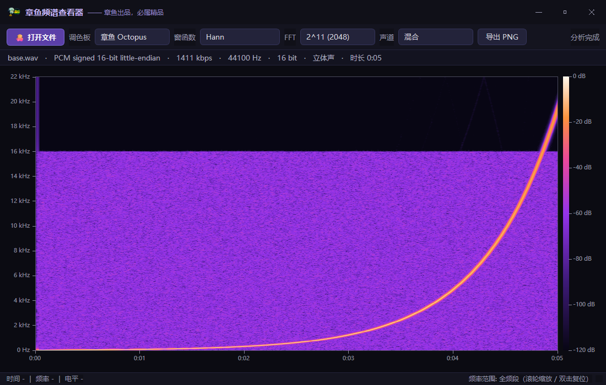
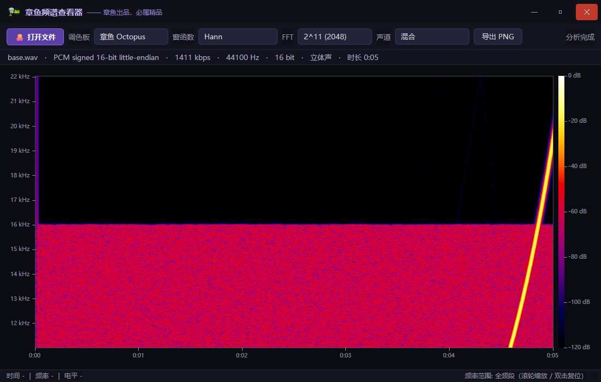

# 🐙 章鱼频谱查看器 (Octopus Spectrum Viewer)

> **章鱼出品，必属精品**

一款现代化的声学频谱分析器，灵感与算法源自 [Spek](https://github.com/alexkay/spek) 及其活跃分支 [Spek-X](https://github.com/MikeWang000000/spek-X)，使用 Python + PySide6 全面重写并美化。

典型用途：**鉴别"假无损"音频**（频谱在高频处齐齐截断的，多半是有损转码）、观察音频的频谱分布与隐藏图案。



## ✨ 功能特性

- **全格式解码**：基于 FFmpeg (PyAV)，支持 WAV / FLAC / MP3 / M4A(AAC) / OGG / OPUS / APE 等几乎所有音频格式
- **像素自适应分辨率**：频谱图列数 = 绘图区像素宽度，窗口拉得越宽算得越细，不算一个多余的 FFT
- **渐进式渲染**：边解码边绘制，逐列"生长"，无需等待整首歌曲分析完毕
- **悬停十字线读数**：鼠标所指即显示 时间 / 频率 / 电平(dB) —— Spek 没有的功能
- **频率轴缩放**：滚轮以光标为中心缩放频率轴，双击复位；聚焦超声区看隐藏内容的利器
- **4 种调色板**：章鱼 Octopus（独家）/ SoX 经典 / 光谱 Spectrum / 灰度 Mono
- **参数可调**：FFT 大小 2⁸~2¹⁴、Hann / Hamming / Blackman-Harris 窗函数、声道切换（混合/单声道）
- **导出 PNG**：所见即所得保存频谱图
- **现代化 UI**：深色主题、自定义标题栏、拖拽打开文件、文件信息面板



## 📦 下载与安装

### 方式一：安装程序（推荐）

从 [Releases](../../releases) 下载 `OctopusSpectrumViewer-setup-x.x.x.exe`，双击安装即可（含桌面快捷方式与卸载程序）。

### 方式二：绿色单文件

从 [Releases](../../releases) 下载 `OctopusSpectrumViewer-x.x.x.exe`，免安装直接运行。

### 方式三：源码运行

```bash
pip install PySide6 numpy av
python run.py
```

也支持命令行直接打开文件：

```bash
python run.py path/to/audio.flac
```

## 🎹 操作指南

| 操作 | 说明 |
|---|---|
| 打开文件 | 点击「🐙 打开文件」，或将音频文件**拖入窗口** |
| 移动鼠标 | 十字线 + 读数框显示当前 时间 / 频率 / 电平 |
| 滚轮 | 以光标为中心缩放频率轴 |
| 双击频谱区 | 频率轴复位为全频段 |
| 切换调色板 / 窗函数 / FFT 大小 / 声道 | 工具栏下拉框，切换后自动重新计算 |
| 导出 PNG | 点击「导出 PNG」保存当前频谱图 |

## 🔬 技术原理

致敬 Spek 的经典流水线设计：

```
音频文件 → FFmpeg 解码 (float32) → 环形分帧 → 加窗 FFT → 区间内幅度平均 → dB 映射调色板 → 逐列渲染
```

- **像素即数据**：列数 = 像素宽度，时间区间用 Bresenham 式误差累积均匀分摊到每一列
- **FFT 参数**：默认 2¹¹ = 2048 点（1025 频带），hop = nfft（不重叠），区间内多次 FFT 幅度取平均
- **dB 范围**：0 ~ -120 dB，满幅正弦（Hann 窗）≈ 0 dB
- **自适应刻度尺**：从 {1, 2, 5, 10, ...} 因子表自动选择刻度间隔，保证标签不重叠

与 Spek 的主要差异：界面框架由 wxWidgets 换为 Qt6 (PySide6)，解码由 libav 直接调用换为 PyAV，全部 FFT 计算由 NumPy 向量化完成，并新增了十字线读数、频率缩放、章鱼调色板等特性。

## 🛠 自行打包

```powershell
# 单文件 exe（PyInstaller）
python -m PyInstaller --clean --noconfirm octopus_spek.spec

# 安装程序（需要 Inno Setup 6）
& "C:\Path\To\Inno Setup 6\ISCC.exe" setup.iss
```

## 📁 项目结构

```
├── run.py                  # 入口
├── octopus/
│   ├── decoder.py          # PyAV(FFmpeg) 解码层
│   ├── worker.py           # 频谱计算流水线（QThread + NumPy STFT）
│   ├── palette.py          # 调色板（章鱼/SoX/光谱/灰度）
│   ├── spectrogram.py      # 频谱渲染控件（刻度尺/十字线/缩放）
│   └── main.py             # 主窗口（标题栏/工具栏/信息面板）
├── tests/                  # 冒烟测试 / GUI 测试 / 测试音频生成
├── test_media/             # 测试音频（含 16kHz 高切"假无损"样本）
├── icon/HMSicon.png        # 应用图标
├── octopus_spek.spec       # PyInstaller 配置
└── setup.iss               # Inno Setup 安装包脚本
```

## 📜 许可证

本项目遵循 [GPL-3.0](LICENSE) 开源（与 Spek 保持一致）。

## 🙏 致谢

- [Spek](https://github.com/alexkay/spek) — 原作者 Alexander Kojevnikov
- [Spek-X](https://github.com/MikeWang000000/spek-X) — 活跃维护分支
- FFmpeg / PyAV / PySide6 / NumPy
